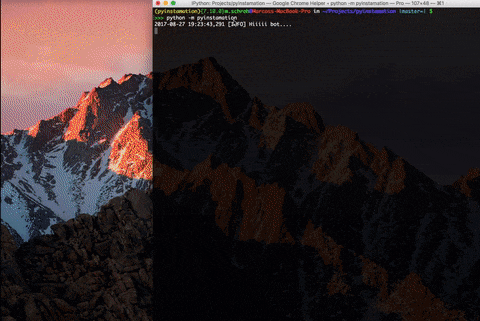

# PYINSTAMATION

> Easy to use, config oriented, instagram bot, written in python 3



## Features

- [x] Upload pictures
- [x] Farm followers with the follow/unfollow technique
- [x] Like and comment by tags
- [x] Metrics persisted in db
- [x] Logging
- [x] Comment generator
- [ ] Daemonize and upload pics/vids at exact time
- [ ] Support for plugins
- [ ] Web with graphs and statistics
- [ ] Dockerization


## TODO

These will be removed once completed

- [ ] Gather more posts to like (currently it does not reach the max likes to give )
- [ ] Ignore post of users already followed
- [ ] Finish tests


## Supported OS

```
Linux (Tested in debian)
OS X
```


## Requirements

```
python 3
```

Remember to create a [virtualenv](https://virtualenv.pypa.io/en/stable/installation/)


## Instalation

`pip install -r requirements.txt`


## Usage

| Command | Description |
| --- | --- |
| `make init` | Downloads webdriver and creates a new conf based on the default one |
| `make run-bot` | Starts running the bot (remember to at least set the username and password) |


## Configuration

Create a `config.yaml` and tune it at will, or use `make init`.
The options are divided in different sections.

| Option | Type | Description |
| --- | --- | --- |
| username * | str | instagram username to operate with |
| password ** | str | username's password |
| `hide_browser` | bool | does not display the browser |

\*  Required

** Required unless the bot is launched with `-p [PASSWORD]`


### Posts

| Option | Type | Description |
| --- | --- | --- |
| `search_tags` | str | comma separated tags to search for |
| `ignore_tags` | str | comma separated tags to ignore if a post contains them while searching |
| `posts_per_hashtag` | int | |
| `likes_per_day` | int | maximum likes given in a day |
| `like_probability` | float | probability to give a like |
| `comment_enabled` | bool| bot will comment in the searched posts |
| `comment_generator` | bool | bot will generate a random generic comment |
| `custom_comments` | array | in case you don't want random comments, you can provide them |
| `total_to_follow_per_hashtag` | int | |

### Followers

| Option | Type | Description |
| --- | --- | --- |
| `follow_enable` | bool | while searching the bot will also follow people |
| `min_followers` | int |  |
| `max_followers` | int |  |
| `follow_probability` | float | chance to follow someone while searching, between 0 and 1 |
| `ignore_users` | array | users not to follow |
| `follow_per_day` | int | max number of users to follow |
| `unfollow_followed_users` | bool | after a few days the bot will stop following the users followed |

### Pics

| Option | Type | Description |
| --- | --- | --- |
| `upload` | bool | when enabled attempts to upload a picture if there is one to upload |
| `files` | collection | the contents of the files to upload are below |

#### Pics > files

| Option | Type | Description |
| --- | --- | --- |
| `path` | str | absolute path to the file location |
| `datetime` | str | format: `%Y-%m-%d %H:%M` eg: `2017-08-18 18:00`. For now, time is ignored, but the idea is to take it into account |
| `comment` | str |  |

For config template check [default.config.yaml](./default.config.yaml)


We told you it was easy.
